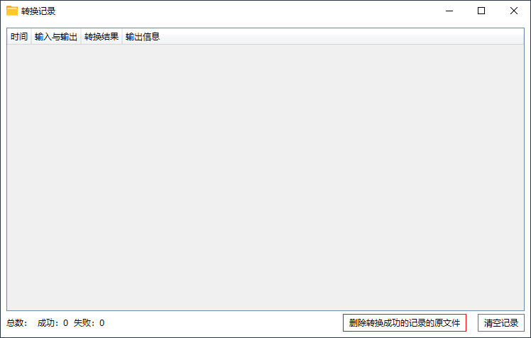

## ImageCvt

 

## 功能说明

监视目录并自动把目录里新增或被重命名为目标格式的图像转换为指定格式

项目的图像转换模块 `ImageCvt/Library/libimgcvt.dll` 来自 [libimgcvt](https://github.com/hrpzcf/libimgcvt)，提供 JPEG/PNG/WEBP 图像之间互转的功能，详情请点击前往查看。

 

## 软件截图

