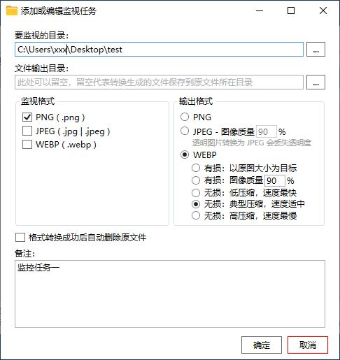

## WebpCvt / Webp 图像转换

 

## 软件说明

用于监视目录，自动把所监视的目录里新增的 webp 文件转换为 jpeg/png/bmp 文件。

项目的图像转换模块 `WebpCvt/Library/webpcvt.dll` 来自 [libwebpcvt](https://github.com/hrpzcf/libwebpcvt)，提供 webp 图像转换为 jpeg/png/bmp 格式图像的功能，详情请点击前往查看。

 

## 软件截图

